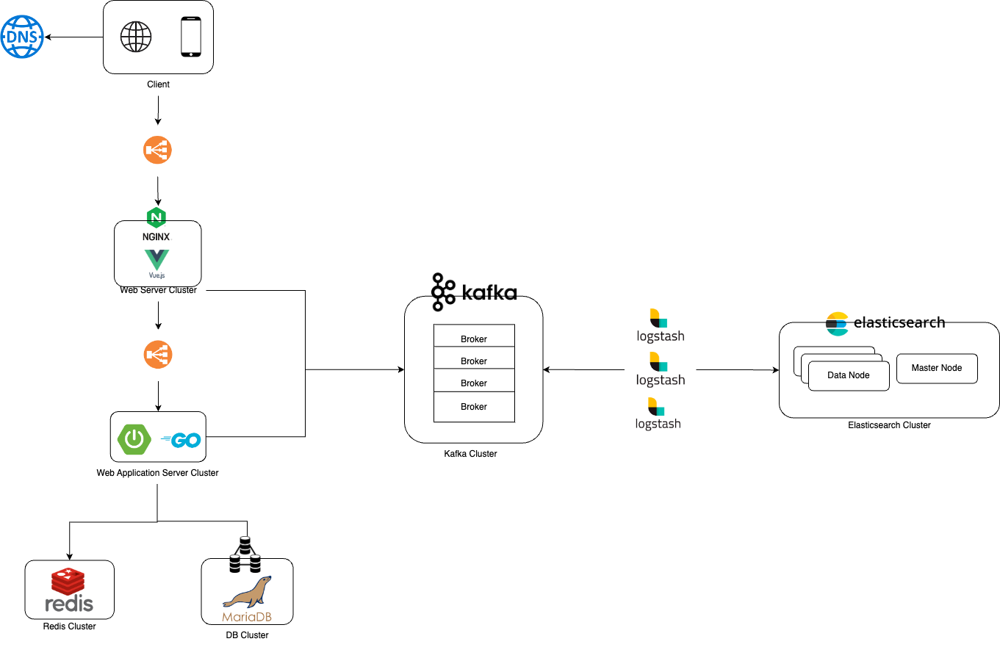
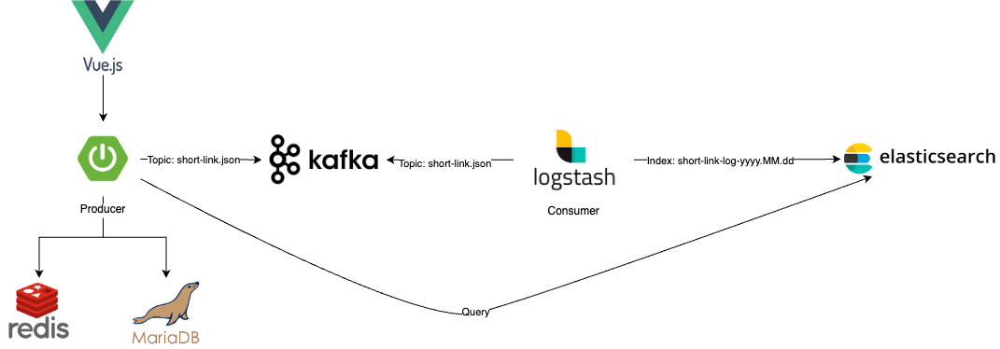

# Tiny Url API and Statistics System

## [Description](https://velog.io/@dragonappear/Outline)

-   The project is a design system that responds to 1 billion traffic a day.
-   Tracking Link provides a service that allows users to navigate to the URL they want.
-   Various information can be attached to the Tracking Link as a parameter, in which case the URL becomes very long.
-   To solve this problem, we develop a function that shortens the URL and a tracking function.

### Demonstration

**If the gif files below do not load, please wait.**

*url shorten*


*redirection*


*statistics*


---
## Tech

To see details on each layer, click on

- Web Server: [Nginx with Vue.js3 ](./nginx/README.md)
- WAS: [SpringBoot](./springboot)
- Caching: Redis
- Data Clustering: [Kafka](./kafka/README.md), [ElasticStack](./elasticstack/README.md)

---
## [System Architecture](https://velog.io/@dragonappear/System-Design)



---
## [Assumption & Prediction](https://velog.io/@dragonappear/Outline#%EC%9A%94%EA%B5%AC%EC%82%AC%ED%95%AD-%EA%B0%80%EC%A0%95-%EB%B0%8F-%EC%98%88%EC%83%81)

<details markdown="1">
<summary style="font-size: large">Assumption</summary>

- 가정 1: Short URL은 Read Heavy 함.
    - Write 작업 수보다 Read 작업 수가 훨씬 더 많을 것으로  Read Heavy 하다고 가정
    - `read 및 redirection requests :write requests = 100:1`이라고 가정함.
- 가정 2: 데이터를 3년 동안 저장함.
    - 요구 사항에는 없지만, 데이터를 3년 동안 저장해야 한다고 가정.
- 가정 3: 각 데이터의 용량은 최대 500 Byte
- 가정 4: Short URL은 8:2 법칙([파레토 원칙](https://ko.wikipedia.org/wiki/%ED%8C%8C%EB%A0%88%ED%86%A0_%EB%B2%95%EC%B9%99))을 따른다
</details>

<details markdown="1">
<summary style="font-size: large">Prediction</summary>

- 예상 1: 가정 1에 따른 `Requests per day Estimates(하루동안 발생하는 요청수)`
    - `read 및 redirection requests per day`
        - approximately **990M(9억 9천만)**
    - `write requests per day`
        - approximately 1**0M(1천만)**
- 예상 2: 가정 1에 따른 `Traffic per sec Estimates(단위 초당 발생하는 트래픽)`
    - `read 및 redirection requests per sec`
        - 990M /  24hr * 3600sec = approximately. **11,458 / sec**
    - `write requests per sec`
        - 10M /  24hr * 3600sec = approximately **115.74 / sec**
- 예상 3: 가정 1,2,3에 따른  `Storage per 3 years Estimates(DB 용량)`
    - `write requests per day`
        - **10M(1천만)**
    - `data counts during 3 years`
        - 10M * 30 days * 12 month * 3 years = approximately **10.8B (108억)**
    - `Needed total storage per 3 years`
        - 10.8B * 500bytes = approximately **5.4TB**
- 예상 4: 가정 1,3에 따른  `Bandwidth per sec Estimates(대역폭)`
    - `write requests per sec * data size`
        - **500 bytes * 115.74  / sec = approximately 57.87KB**
    - `read 및 redirection requests per sec * data size`
        - **500 bytes * 11,458 / sec =  approximately. 5.729MB**
- 예상 5: 가정 1,3,4에 따른  `Caching Memory Estimates(캐시 메모리)`
    - URL의 20%를 캐싱하면 대략 80 퍼센트의 캐시 히트가 발생할 것이라고 예상할 수 있다.
    - 하루 당 **990M Read Requests가 발생하므로, 이 중 20%만 캐싱을 한다고 하면 필요한 메모리 용량은**
        - **990M * 0.2 * 500Bytes = 대략 100GB**
        - 중복된 요청이 발생한다고 가정하면 실제 필요한 캐싱 용량은 **100GB** 보다 더 적을 것으로 예상된다.

</details>

<details markdown="1">
<summary style="font-size: large">Total</summary>

- Write Requests: **115.74/s**
- Read Requests: **11458/s**
- Incoming Data: **57.87KB**
- Outgoing Data: **5.729MB**
- Storage for 3 years: **5.4TB**
- Memory for Caching: **100GB**

</details>
    

---
## How to build and run project

You must install docker, npm, jdk17 and gradlew

1. `docker-compose up -d`
2. Create database name `tiny_link`
3. `cd java && ./gradlew clean build && java -jar *.jar`
4. `cd nginx && npm install && npm run dev`
5. enter -> `localhost:5173`

### Local Architecture



---

## Database

Database used on this project is MariaDB

`ddl`
```sql
create table short_link
(
    id_short_link bigint auto_increment
        primary key,
    created_at    datetime(6)  not null,
    original_url  text         not null,
    short_id      varchar(255) not null,
    client_ip     varchar(255) not null,
    user_agent    varchar(255) null,
    constraint uk_short_id
        unique (short_id)
);

create index idx_client_info
    on short_link (user_agent, client_ip);
```

---
## TroubleShoot

To see details on each link, click on

- [Data cleaning](https://velog.io/@dragonappear/data-cleaning)

- [Unique Key Concurrency](https://velog.io/@dragonappear/DB-Unique-Key-Concurrency)

- [Unique Key preprocessing](https://velog.io/@dragonappear/DB-Unique-Key-preprocessing)

- [Database Error Handling](https://velog.io/@dragonappear/DB-Database-Error-Handling)

- [System Security](https://velog.io/@dragonappear/Security)