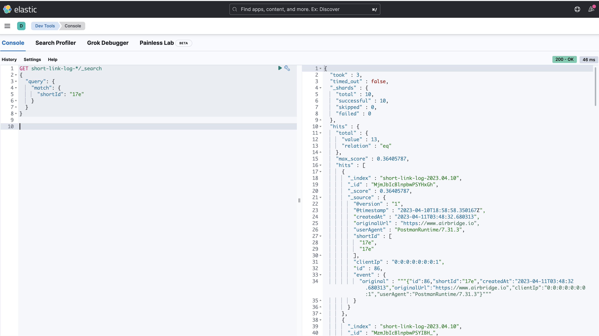
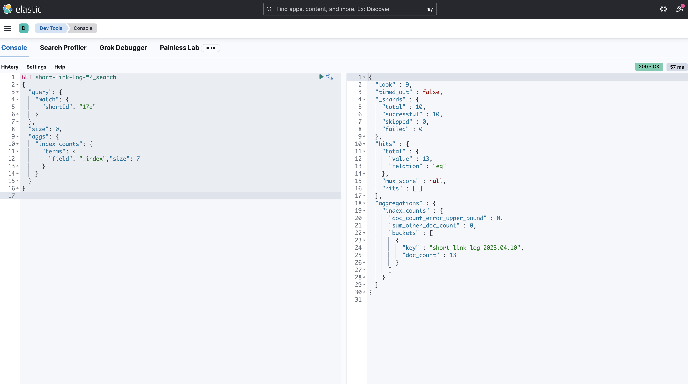

# ElasticStack

## Tech

- logstash: consume data from kafka and load to elasticsearch
- elasticsearch: search engine
- kibana: data visualization with elasticsearch

---
## Demonstration

---
## Architecture

---
## [Installation](https://www.elastic.co/kr/elastic-stack/)

It is configured by installing dockers or by installing them directly without using Enterprise or AWS elasticsearch.

### Logstash

- pipeline
  - [In: kafka, Out: Elasticsearch](./logstash/logstash-kafka.conf)

### ElasticSearch

- short-link-index
  - [policy](./elasticsearch/short-link-log-policy.json)
    - 인덱스 생명주기 10일
  - [index-template](./elasticsearch/short-link-log-template.json)
    - 위 policy 적용
  - [shortId statatics query](./elasticsearch/short-link-log-statics-query.json)

### Kibana

---

## ETC

No security is set because this is for local environment

---

## TroubleShoot

- 버전별 security 설정이 변함
  - 참고: https://www.elastic.co/guide/en/kibana/current/xpack-security.html
  - https://levelup.gitconnected.com/how-to-run-elasticsearch-8-on-docker-for-local-development-401fd3fff829
- Kafka,Logstash 연동
  - 참고: https://zkdlu.github.io/2021-01-22/ELK03-ELK/
  
