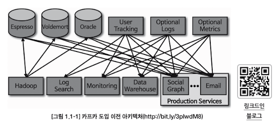
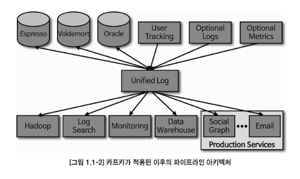
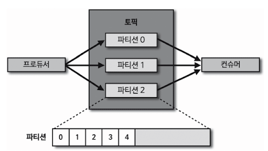

# Apache-Kafka
---

## Why Apache-Kafka

카프카는 4가지 특징을 가진다.

1. 높은 처리량
   - 묶음 전송
   - 파티션 단위로 데이터 분배 및 병렬 처리
2. 확장성
   - 스케일 인/아웃 용이
3. 영속성
   -   메모리에 저장하지 않고 파일 시스템에 저장한다.
   -   파일 시스템 속도를 최적화 하기 위해서 OS에서 페이지 캐시 영역을 메모리에 따로 생성하여 사용한다.
4. 고가용성
   

카프라클 사용하면 데이터 스트림을 한 곳에서 실시간으로 관리할 수 있다.

소스 어플리케이션과 타겟 어플리케이션 사이의 의존도를 최소화하여 커플링을 완화한다.

1:1 매칭으로 개발하고 운영하던 데이터 파이프라인에서 커플링으로 인해 한쪽의 이슈가 다른 한쪽의 어플리케이션에 영향을 미치곤 했지만, 카프카를 통해서 이러한 의존도를 낮출 수 있다.

소스 어플리케이션에서 생성되는 데이터는 어느 타겟 애플리케이션으로 보낼 것인지 고민하지 않고 일단 카프카로 넣으면 된다.

### Kafka Main Architecture

- 데이터 포맷은 사실상 제한이 없다
  - 직렬화, 역직렬화를 통해 ByteArray로 통신하기 때문에 자바에서 선언 가능한 모든 객체를 지원한다.
- 카프카 클라이언트에서는 기본적으로 ByteArray,ByteBuffer,Double,Long,String 타입에 대응한 직렬화, 역직렬화 클래스를 제공한다.

### Production Environment

- 상용 환경에서는 카프카는 최소 3대 이상의 서버(브로커)에 분산 운영하여 프로듀서를 통해 전송받은 데이터를 파일 시스템에 안전하게 기록한다.
- 카프카 클러스터 중 일부 서버에 장애가 발생하더라도 데이터를 지속적으로 복제하기 때문에 안전하게 운영할 수 있다.
- 배치 전송을 통해 낮은 지연과 높은 데이터 처리량도 가진다.

---

##  [Installation](https://kafka.apache.org/downloads)

**AWS MSK 나 컨플루언트 클라우드를 활용하지 않고 직접 설치하여 운영한다.**

---

##  Commands Line

- [카프카 브로커 실행 옵션 설정](./kafka-3.4.0-src/config/server.properties)
    - `advertised.listeners=PLAINTEXT://localhost:9092` : 로컬환경에서 실행할 경우
    -  `zookeeper.connect=localhost:2181`: 로컬환경에서 실행할 경우
    -  

- Zookeeper 실행
  -   주키퍼는 카프카의 클러스터 설정 리더 정보, 컨트롤러 정보 등 카프카를 실행하는 데에 필요한 필수 어플리케이션
  -   주키퍼 역시 상용환경에서 안전하게 운영하기 위해서 3대 이상의 서버로 구성해야 함.
  -   로컬에서 테스트로 진행할 경우, 1대만 실행해도 되지만 비정상적인 운영이다.
  -   `bin/zookeeper-server-start.sh config/zookeeper.properties`
  -   jvm 프로레스 상태 확인 : `jps -m`

- Kafka broker 실행
  - `bin/kafka-server-start.sh config/server.properties`
  -   jvm 프로레스 상태 확인 : `jps -m`

- 로컬 환경 연동 테스트
  - `bin/kafka-broker-api-versions.sh --bootstrap-server localhost:9092`

- 토픽 생성
  - `shortLink.log`이란 이름으로 토픽 생성
  - `bin/kafka-topics.sh --create --bootstrap-server localhost:9092 --config retention.ms=172800000 --topic shortLink.log`
    - `config retention.ms`: 토픽 데이터 유지 기간
      - 172800000ms 는 2일을 의미하고, 2일이 지난 토픽의 데이터는 삭제된다.
    - `topic`: 토픽 이름
  - 토픽 조회: `bin/kafka-topics.sh --bootstrap-server localhost:9092 --list`
  - 상세 조회 : `bin/kafka-topics.sh --bootstrap-server localhost:9092 --describe --topic shortLink.log`

- 토픽 옵션 수정
  - 파티션 수정: `kafka-topics.sh`
  - 토픽 삭제 정책(리텐션 기간): `kafka-configs.sh`
  - 파티션 개수 3개 -> 4개로 수정
    - `bin/kafka-topics.sh --bootstrap-server localhost:9092 --topic shortLink.log --alter --partitions 4`
  - 리텐션 기간 수정
    - `bin/kafka-configs.sh --bootstrap-server localhost:9092 --entity-type topics --entity-name shortLink.log --alter --add-config retention.ms=86400000`

---

## TroubleShoot

-  `bin/zookeeper-server-start.sh -daemon config/zookeeper.properties`
   - 에러: Classpath is empty. Please build the project first e.g. by running './gradlew jar -PscalaVersion=2.13.10'
   - 원인: sh 파일에서 jar 파일을 먼저 java -jar 해야되는데, jar 파일이 존재하지 않기  때문에 발생하는 에러
   - 해결: `./gradlew jar -PscalaVersion=2.13.10`

